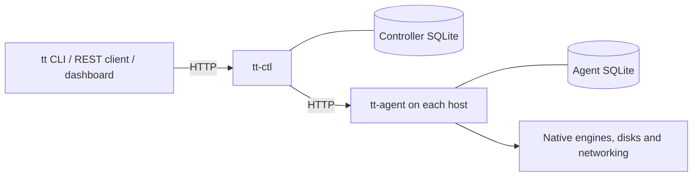

# Architecture and ownership

TTstack has one controller for fleet coordination and one agent per resource host.
The CLI, REST clients, and browser dashboard use the controller API. Each service
keeps its own SQLite state; engines, disks, and guest networking remain local to
the agent host. No message queue or external database service is required.

## Component boundaries

| Component | Owns | Source entry points |
| --- | --- | --- |
| `tt` (`crates/cli`) | Controller client, local image recipes, local/distributed deployment | [Commands](../crates/cli/src/main.rs), [client](../crates/cli/src/client.rs), [recipes](../crates/cli/src/image_builder.rs), [deployment](../crates/cli/src/deploy.rs) |
| `tt-ctl` (`crates/ctl`) | Host registration, placement, environment lifecycle, expiry, fleet observations and dashboard | [Routes and workers](../crates/ctl/src/main.rs), [handlers](../crates/ctl/src/handler.rs), [scheduler](../crates/ctl/src/scheduler.rs), [database](../crates/ctl/src/db.rs), [backup coordination](../crates/ctl/src/backup.rs) |
| `tt-agent` (`crates/agent`) | Local admission, VM identity, retained storage, engine operations, network ownership and recovery | [Routes and workers](../crates/agent/src/main.rs), [handlers](../crates/agent/src/handler.rs), [runtime](../crates/agent/src/runtime.rs), [backup workers](../crates/agent/src/backup.rs), [SSH ingress](../crates/agent/src/ssh_ingress.rs) |
| `ttcore` (`crates/core`) | Shared models and API types, capability contracts, native engines, storage and networking | [API](../crates/core/src/api.rs), [models](../crates/core/src/model.rs), [capabilities](../crates/core/src/capability.rs), [engines](../crates/core/src/engine/mod.rs), [storage](../crates/core/src/storage/mod.rs) |

`ttcore` is a library, not a separate service. Linux builds select QEMU/KVM,
Firecracker and Docker/Podman host implementations. Experimental FreeBSD builds
select bhyve and Jail. Shared models and the capability matrix include both
platforms so one controller can coordinate a mixed fleet; a tag cannot enable
another OS's host implementation. See [compatibility](compatibility.md).

## Requests and durable lifecycle

An environment groups VM/container records for lifecycle operations. Its name is
the controller's identifier; each VM has its own UUID and assigned host. An owner
string is a label, not an authorization boundary or operating-system account.

Creation follows these ownership boundaries:

1. The controller validates the request, refreshes host observations, chooses
   eligible placements, and saves the environment and planned VM records before
   provisioning. Reservations include plans accepted since the last agent snapshot.
2. A background operation sends each VM request to its assigned agent. The agent
   validates local prerequisites and instance eligibility, persists its record,
   and creates storage, networking, and the owned engine process/container.
3. The controller records returned VM observations and derives the environment
   state. HTTP 202 acknowledges the saved plan; `active` means all VM processes
   are running without reported errors. Neither confirms application readiness.
4. On a timeout or partial failure, the saved identity and remaining resources
   stay available for inspection. A repeat environment name is a conflict, while
   an exact direct-agent creation retry can reuse its VM record. Inspect before
   retrying; do not assume that an interrupted client cancelled the operation.

Stop retains disks or container filesystems and releases execution reservations.
Start cold-boots/restarts that retained workload on the same host after a capacity
check. VM memory is not retained. Delete and expiry remove runtime storage and any
disk recovery points; unfinished cleanup keeps its records and is retried.

The [REST API](rest-api.md#lifecycle-and-recovery) owns exact state, retry,
timeout and recovery semantics. Controller restart does not automatically replay
failed creation, and host reboot does not automatically start retained guests.

## Coordination and observations

Controller mutations serialize per environment, with short database critical
sections for placement and state updates. Unrelated environments and host refresh
can progress concurrently. Agent lifecycle mutations serialize through the host
runtime; reconciliation yields between VM checks. Slow backup storage work uses
persisted exclusion and owned storage locks while releasing the runtime mutex.
Its retry protocol is maintained in [disk backup](disk-backup.md#api-and-exact-retries).

Agent VM/resource reads use database snapshots. Image scanning has its own
background cache, so a slow image inspection does not block health reads. The
controller combines these observations with its own pending plans and operations;
an older observation must not erase uncertain resize or backup intent.

An online agent is reachable, not proof that every engine, image, guest service,
or application is healthy. An offline host retains its last observations and
reservations but cannot receive new placement. Missing or untracked allocations
remain visible or conservatively accounted; they are not silently adopted or
deleted. Inspection and readiness fields are described in the
[API resource reference](rest-api.md#returned-state-and-resources) and [SSH guide](ssh.md).

## Placement, storage and capabilities

Placement uses configured CPU, memory and logical disk reservations, not measured
host load. Stopped guests keep disk reservations and tracked instance slots.
The scheduler checks online status, engine/storage capabilities, image availability
and capacity, preferring eligible zvol hosts for VMs and then packing by remaining
memory. Docker uses its selected runtime's image store independently of VM storage.

The shared capability registry separates design support from scoped host
prerequisites and per-operation eligibility. The same requirements drive controller
validation, placement, direct-agent admission and dashboard controls. A supported
matrix cell does not establish that a particular disk, image or running VM is
eligible. [Technical capabilities](capabilities.md) owns report versions, legacy
compatibility and admission-withdrawal behavior.

Images are prepared on each agent host. The `file` and `zvol` backends handle VM
provisioning and retained disks; Docker/Podman manages its own container storage.
There is no image distribution, guest migration, distributed storage or cross-host
private network. [Guest images](guest-images.md) owns layouts, recipes and network
setup. [Disk backup](disk-backup.md) owns optional local recovery points, which
share the host storage's failure domain and do not replace disaster-recovery copies.

## Persistence and access

The controller and each agent hold a lifetime state-directory lock and use SQLite
WAL/FULL writers. Their databases contain different ownership and observation
records; neither database alone reconstructs the fleet or retained disks.
Schema checks, controller migration, the explicit offline agent converter and
rollback requirements are maintained in
[deployment compatibility](deployment.md#persistent-state-schema-gate).

Deployment configures a shared administrator API key. Services use HTTP without
built-in TLS; management transport and listener reachability are deployment
responsibilities. Guest login uses caller-supplied SSH public keys or image-owned
credentials independently of that API key. User identity, application installation,
entitlements and idle-stop policy belong to callers.

The dashboard exposes inventory, capabilities and basic environment actions,
including supported SSH-key input. Custom SSH accounts, guest configuration,
offline resize and disk backup use the CLI or REST API. See the
[README access guide](../README.md#access-and-authentication), [API](rest-api.md),
and [SSH contract](ssh.md) for their respective interfaces.

Return to the [documentation index](README.md).
