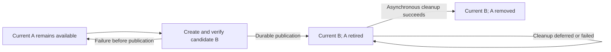

# Proposal: opt-in VM disk backup with one current recovery point

Status: **Draft for review; not implemented.** The
[review](audit.md) confirms that status and records integration constraints.
This document proposes behavior; it does not add commands, API endpoints,
configuration options, or support claims.

Research date: 2026-09-29. Repository baseline:
[`0547f3c`](https://github.com/TTstack/TTstack/tree/0547f3caeac3590fb86ed342ff0de94eba43a4cc),
workspace version 0.5.1. Upstream documentation was inspected on the research
date; upstream `master`, `main`, and `latest` references are not deployment
version guarantees. No VM, storage, or restore experiment was performed for this
proposal. Neither `qemu-img` nor `zfs` was available in the research workspace.

## 1. Problem and intended outcome

TTstack retains VM disks across stop/start but provides no managed recovery point
for reverting unwanted guest disk changes. Operators currently have to coordinate
storage tools and TTstack lifecycle themselves. The requested addition is a small,
optional disk backup facility, with no memory capture or backup history product.

The requested meaning of **one backup** is one published recovery point, not a
physical limit of one artifact. Once a valid backup exists, a refresh must keep
at least one valid backup throughout normal operation and recoverable failures.
Old generations may remain temporarily and be cleaned up asynchronously. A first
backup has no earlier recovery point to preserve; a failed first attempt must
report that no backup is available.

The preservation requirement excludes explicit backup removal, destructive VM
deletion/expiry, storage corruption, loss of the host/pool, and external operator
modifications. It must not be weakened to merely retaining a database row that
points to a missing or incomplete artifact.

Here, valid means a complete, identifiable disk recovery point that can restore
its captured block state with the documented retained VM dependencies. It does
not certify that the captured guest was healthy or its application data correct.
Refreshing from an already-broken guest can replace an older useful state, which
is one reason to keep the trigger explicit.

### Requirements and proposed decisions

| Item | Basis | Meaning |
| --- | --- | --- |
| Disabled by default | Requested | Ordinary creation, stop/start, and deletion do not automatically create backups. |
| Disk data only | Requested | Capture guest-visible disk blocks; no RAM, device execution state, or suspended VM. |
| One current recovery point | Requested, clarified | Publish a replacement only after it is complete; retain older generations until safe asynchronous cleanup. |
| Lightweight ZFS path | Requested direction | Prefer native snapshots of the owned VM disk volume. |
| File backend analysis | Requested | Assess both qcow2 snapshots and filesystem reflinks, including unsupported cases. |
| Manual trigger; stopped VM | Recommended boundary | Callers explicitly request backup/restore; TTstack does not stop or restart guests implicitly. |
| Restore into the same existing VM | Recommended boundary | Keep VM identity and management metadata; do not implement import or recovery after VM deletion. |
| VM deletion also removes backups | Recommended boundary | Preserve the existing destructive deletion/expiry contract; this is not protection against deleting the VM. |
| Lightweight backup only | Requested, mandatory | If the runtime cannot provide a qualified lightweight, fast backup mechanism, return backup unsupported. Full-file-copy backup is excluded, including explicit opt-in and fallback paths. |

The recommended boundaries require product review before implementation. They
are not additional requirements already approved by the requester.

In the design sections, **must** identifies a correctness condition of the
proposed contract; **recommend** identifies a design choice still open to review.

## 2. Current implementation and integration points

| Area | Inspected behavior | Consequence |
| --- | --- | --- |
| [CLI](../../crates/cli/src/main.rs), [controller routes](../../crates/ctl/src/main.rs), [agent routes](../../crates/agent/src/main.rs) | No backup, restore, or backup-removal operation. | New operations must cross all three layers. |
| [ImageStore](../../crates/core/src/storage/mod.rs) | Clone, remove, resolve, inspect, and grow images. | Backup mechanics belong near storage, not in guest applications. |
| [ZvolStore](../../crates/core/src/storage/zvol.rs) | Fixed base-image `@ttsnap`; runtime clones; recursive runtime deletion. | Base snapshots do not capture later guest writes. Existing deletion can remove runtime snapshots. |
| [FileStore](../../crates/core/src/storage/file.rs) | QEMU qcow2 files; directory/file copies using `cp --reflink=auto`. | Backup must not inherit provisioning's full-copy fallback. |
| [QEMU](../../crates/core/src/engine/qemu.rs) | One writable root drive plus a read-only seed, with a monitor socket. | No existing backup job orchestration; shelling out to `qemu-img` must remain offline. |
| [Firecracker](../../crates/core/src/engine/firecracker.rs), [sandbox](../../crates/core/src/engine/firecracker/sandbox.rs) | Writable raw root disk, optional read-only config disk, file hard links or jailed block devices. | Rootfs replacement must agree with the jail rebuilt on cold start. |
| [Docker/Podman](../../crates/core/src/engine/docker.rs) | Runtime-managed container storage, bypassing `ImageStore`. | Agent `file`/`zvol` selection does not describe container storage. |
| [Agent runtime](../../crates/agent/src/runtime.rs) | Persisted VM rows, native schema v5, pending resize intent; WAL with `synchronous=NORMAL`. | Backup needs durable intent, ownership, and reservations; an in-memory flag is insufficient. |
| [Controller](../../crates/ctl/src/handler.rs), [database](../../crates/ctl/src/db.rs) | Per-environment mutation coordination, schema v4, conservative merges of pending resize intent. | Backup intent must survive old host observations and ambiguous agent responses. |

Current [storage](../guest-images.md#storage),
[lifecycle](../rest-api.md#lifecycle-and-recovery), and
[upgrade](../deployment.md#upgrade-compatibility) guides remain authoritative for
implemented behavior. The [0.5.1 upgrade report](../validation/version-0.5.1-upgrade-2026-09-28.md#backup-cleanup-and-limits)
records manually taken backups, explicitly without restore validation; it is not
evidence that the proposed API or its recovery protocol works.

## 3. Scope and operator semantics

### 3.1 Activation and trigger

Propose one agent option, `--enable-disk-backup`, defaulting to false. This is a
host admission gate, not a schedule. A supported VM gets its first recovery point
only through an explicit backup request; another request refreshes it. There is
no additional per-VM boolean, automatic initial backup, timer, or stop/start hook.

Turning the gate off rejects new backup creation/refresh, but must not delete
existing artifacts or strand them: inspect, restore, explicit removal, and
cleanup of already-owned generations remain available. Agents report admission
enabled separately from backend capability. A disabled service restart must
still load and account for existing backup records.

The alternative is no host gate and explicit per-VM invocation alone as opt-in.
That is smaller operationally but interprets "disabled" as "never automatically
invoked." Section 13 identifies this as a review decision.

### 3.2 Captured data and restore target

The proposed payload is the existing VM's single writable root disk, including
its partitions/filesystem, installed software, guest keys, and application files.
Host-side records needed to identify and validate that payload are bookkeeping,
not a backup of the fleet database.

Excluded: RAM, CPU/device state, host networking, controller/agent databases,
Firecracker's host kernel file, QEMU's generated SSH seed, and Firecracker's
immutable configuration drive. The current kernel, config drive, bootstrap seed,
and management records must remain available and compatible. Record their
relevant identity/digest where available and reject known incompatibilities.
Root-disk-only restore cannot reconstruct these dependencies if they are lost.

Restore overwrites the current root disk state, retains the recovery point for
reuse, and leaves the same VM stopped. UUID, host placement, IP, ports, CPU/RAM,
environment membership, and expiry are not rolled back. Disk rollback can restore
old guest credentials, bootstrap markers, or application state; TTstack must not
claim that external application services or caller databases were rolled back.
Reset cached SSH readiness and verify access after a caller starts the VM.

### 3.3 Consistency and lifecycle boundaries

First-version backup and restore require both recorded and observed stopped
state. `paused`, unreachable, failed observation, or a stale cached `stopped`
value is insufficient. Reject pending creation, resize, restore, or deletion.
Reads remain available while a mutation is in progress.

A stopped VM can have been forcibly terminated. Describe the result as an
offline disk recovery point, not an application-consistent backup. Guest shutdown
and application quiescing remain caller responsibilities. Restoring successfully
does not prove guest boot, SSH access, or application health.

VM/environment deletion and expiry remove the associated backups under the
recommended scope. Backup does not extend lifetime or suspend expiry. An expiry
that becomes due during a disk operation waits for safe serialization, then uses
the destructive deletion path. CLI inspection must expose expiry alongside the
backup so that the default environment lifetime is not mistaken for retention.

No migration, restore-as-new-VM, independent archive, object storage, replication,
guest agent, multi-disk atomic group, encryption service, or dashboard workflow is
included. Existing API administrator authentication remains unchanged.

### 3.4 Mandatory lightweight capability boundary

Backup creation and refresh must use a qualified snapshot or copy-on-write clone
mechanism that preserves existing disk blocks without copying the complete image
payload. If the actual engine, image, tools, filesystem, or source/destination
placement cannot provide such a lightweight, fast mechanism, return **backup
unsupported**. Check eligibility before admitting a backup operation; never start
a full copy to compensate for a missing capability.

Whole-file or whole-disk copying, including ordinary `cp`, `dd`, sparse full-image
copies, and image conversion, is not a backup implementation in this proposal.
There is no slow mode, opt-in full-copy option, or automatic fallback. Compression,
sparsity, chunking, or background execution does not make full-copy backup eligible.
Strict reflink remains eligible because it shares blocks rather than transferring
the complete payload. This boundary applies to every supported engine/backend.

Capability must be established for the actual runtime, not inferred from a file
extension or filesystem name. A backend error must not trigger copying or an
unvalidated backend switch. Missing capability is distinct from a timeout, an I/O
failure, or insufficient capacity: those retain their own error/recovery semantics
and must not erase an existing valid backup. Metadata work still has a cost;
lightweight capability is not a fixed millisecond latency guarantee.

## 4. Storage research and backend assessment

### 4.1 ZFS zvol: recommended first backend

ZFS provides atomic point-in-time snapshots of a filesystem or volume, without
copying all blocks at creation. Space grows as blocks must be retained after
changes. This supports a local recovery point, not an independent failure domain.
See [OpenZFS snapshot semantics](https://openzfs.github.io/openzfs-docs/man/master/8/zfs-snapshot.8.html)
and [snapshot space and clones](https://openzfs.github.io/openzfs-docs/Basic%20Concepts/Datasets/Snapshots%20and%20Clones.html).

Use the runtime volume, never the base image:

| Engine | Owned snapshot target | Excluded from snapshot |
| --- | --- | --- |
| QEMU | `RUNTIME/clone-VM_ID@ttbackup-GENERATION` | Base image and other VMs |
| Firecracker | `RUNTIME/clone-VM_ID/rootfs@ttbackup-GENERATION` | Parent kernel/config dataset, jail, and other VMs |

These are schematic identifiers, not operator commands. Generate names internally
from persisted ownership and generation IDs; users do not supply arbitrary ZFS
names or paths. Record the snapshot GUID as well as its name to detect replacement.
Do not recursively snapshot the runtime parent or reuse the provisioning `@ttsnap`.
The GUID is a lifetime identity, unlike a reusable name; see
[OpenZFS dataset properties](https://openzfs.github.io/openzfs-docs/man/master/7/zfsprops.7.html).

Restore uses the exact recorded snapshot. Plain rollback refuses certain newer
snapshot conflicts; `-r` destroys intermediate snapshots/bookmarks and `-R` can
also destroy clones. Never automatically add these flags to bypass a conflict.
An abandoned newer TTstack candidate can be removed by its exact owned identity
after recovery determines it is disposable. Foreign artifacts require an explicit
error, not recursive cleanup. [OpenZFS rollback](https://openzfs.github.io/openzfs-docs/man/master/8/zfs-rollback.8.html)
defines these destructive options.

Retired older snapshots can be removed asynchronously while the VM runs, after
validating that the current backup remains published and is not the target.
External holds or dependent clones can prevent deletion. Keep the retirement
record, reservation, and diagnostic; do not force removal of dependencies or use
deferred destruction as evidence that space is already free. See
[OpenZFS destroy](https://openzfs.github.io/openzfs-docs/man/master/8/zfs-destroy.8.html).

Online ZFS backup is technically possible but is deferred: storage atomicity
does not capture guest caches or establish application consistency. Offline-only
semantics keep the first implementation consistent across VM engines.

### 4.2 QEMU files: qcow2 internal snapshots

`qemu-img snapshot` supports creating, listing, applying, and deleting disk
snapshots. It is an offline tool and must not modify an image used by a running
process. Do not substitute QEMU `savevm`, which includes execution state, or the
temporary `-snapshot` launch option. See the
[QEMU image utility](https://www.qemu.org/docs/master/tools/qemu-img.html) and
[VM snapshot distinction](https://www.qemu.org/docs/master/system/images.html).

Internal qcow2 snapshots share data clusters through image metadata. They avoid
a full data copy but still require metadata work; they are not guaranteed to be
constant-time. Images with an external data file do not support internal
snapshots. See the [qcow2 format](https://www.qemu.org/docs/master/interop/qcow2.html).

Proposed eligibility is deliberately narrower than every valid qcow2 image:
standalone, supported and clean qcow2; no backing chain, external data file,
external encryption dependency, unknown feature, or pre-existing unmanaged
internal snapshot. Reject unsupported images without flattening or converting
them as a hidden side effect. Inspect the installed QEMU version and image
features; do not infer eligibility from the `.qcow2` suffix.

The attraction is broad filesystem portability and unchanged runtime disk paths.
The tradeoffs matter to this proposal:

- Active data and backups share one mutable image container. A damaged container
  may invalidate both; retaining an old snapshot entry alone does not prove it is
  restorable after an interrupted metadata mutation.
- Generation cleanup through `qemu-img` also requires a stopped VM. After a VM
  restarts, asynchronous cleanup must wait for another stopped window. It must
  never silently stop the VM or bypass QEMU image locking.
- Backend qualification must cover interrupted create/apply/delete and inspect
  errors. Do not run automatic repair modes to make a failure look successful.
- Resize behavior is format/version dependent. Current upstream
  [QEMU source](https://github.com/qemu/qemu/blob/master/block/qcow2.c) rejects
  resizing older-format images with snapshots; it would be incorrect to state
  that every qcow2 snapshot always prevents resize. The proposed uniform resize
  restriction in section 8 is a TTstack policy, independent of that distinction.

Use operation-specific internal snapshot identifiers and a database pointer to
the current generation. Do not delete a fixed-name snapshot before recreating it.
The first implementation should not introduce QMP live backup jobs just to clean
up retired generations while a guest is running.

**Assessment:** viable lightweight candidate, but conditional on failure testing
and acceptance of the shared-container failure boundary. It is not an automatic
fallback for every QEMU file VM.

### 4.3 File reflinks: applicable to both VM engines

Linux `FICLONE` makes a separate file sharing existing blocks with copy-on-write
isolation. It requires filesystem support and compatible source/destination
placement. The interface is atomic relative to writes, but this is not guest
application quiescing or a promise that a running qcow2 container is recoverable.
See the [Linux reflink interface](https://man7.org/linux/man-pages/man2/FICLONE.2const.html).

Reflinks can preserve a standalone QEMU qcow2 file or Firecracker's raw
`rootfs.ext4`. The latter's ext4 format describes the guest filesystem; capability
depends on the host filesystem holding the file. Never assume that all XFS,
Btrfs, ZFS, or similarly named mounts have identical capabilities. Probe the
actual configured location with task-owned scratch files and recheck the actual
source/destination on each operation. A probe must test independent writes, not
just accept a successful generic copy command.

Use strict reflink creation, through the ioctl or an explicitly non-fallback
tool invocation. The existing provisioning `--reflink=auto` behavior is not an
appropriate lightweight-backup guarantee. Cross-filesystem destinations and
unsupported operations return a capability error, not a full copy.

For QEMU, apply the standalone-image checks from section 4.2 here too: copying
one file must not leave an unrecorded backing file or external data dependency.
Do not clone pre-existing internal snapshot history into each new backup.

Store backup files in a private, separately identified directory on the same
eligible filesystem, outside image catalogs and the directory scanned to resolve
the VM's active disk. Do not make the backup look like a second candidate boot
disk. File permissions must protect guest secrets, independently of source mode.

Restore creates a new writable reflink from the backup into a temporary file,
syncs it, atomically replaces the stopped VM's active file, and syncs the parent
directory. It must not rename the backup itself into the active path: subsequent
guest writes would then consume the only recovery point. File replacement
atomicity and directory durability are different concerns; see
[rename](https://man7.org/linux/man-pages/man2/rename.2.html) and
[fsync](https://man7.org/linux/man-pages/man2/fsync.2.html).

Firecracker's existing jail may still have a hard link to the old active inode.
Remove/rebuild only the owned stopped jail before allowing start, using the
existing cold-start path; preserve the published backup. Hard links are not
reflinks and cannot serve as backups of a writable rootfs.

Retired reflink files can be unlinked asynchronously while the VM runs because
they are not the active disk. Confirm ownership, generation, link relationships,
and path confinement before deletion. Track any retired active inode retained by
an old jail until its links are gone; do not release its reservation early.

**Assessment:** the preferred file strategy where proven available, including
QEMU. It keeps snapshot metadata outside the active qcow2 container and makes
asynchronous retirement easier than offline qcow2 internal snapshots.

### 4.4 Firecracker engine snapshots do not replace disk backup

Firecracker's snapshot API saves VM state and memory; its block-device backing
files remain an external responsibility. Using that API would add excluded memory
state without eliminating disk handling. See
[Firecracker snapshot support](https://github.com/firecracker-microvm/firecracker/blob/main/docs/snapshotting/snapshot-support.md).

For current file rootfs images, use reflink where available. Without filesystem
copy-on-write support, a raw image has no qcow2-style internal snapshot primitive.
A sparse copy can avoid allocating holes but still copies non-hole data and is
excluded by section 3.4 even when the VM is stopped. Return backup unsupported
when no qualified lightweight mechanism is available.

### 4.5 Containers and other alternatives

Docker/Podman commits capture container changes as images rather than snapshotting
one TTstack-managed VM disk. Docker excludes mounted-volume data. Podman exposes
an `--include-volumes` option with its own scope, defaulting to false. Their common
commit interface is therefore insufficient to promise all persistent container
data. See [Docker commit](https://docs.docker.com/reference/cli/docker/container/commit/)
and [Podman commit](https://docs.podman.io/en/latest/markdown/podman-commit.1.html).
Exclude containers from the first version; do not snapshot a shared Docker data
root or infer storage capability from the agent's VM backend.

| Alternative | Assessment for this scope |
| --- | --- |
| QEMU external overlay | Fast to create but introduces active backing-chain changes, refresh/merge work, and cleanup dependencies; defer. |
| Whole-disk/file copy or `qemu-img convert` | Excluded by the mandatory lightweight boundary; neither an opt-in implementation nor a fallback. |
| File images on one shared ZFS dataset | A dataset snapshot can include unrelated VMs; whole-dataset rollback would revert them. Requires per-file extraction or a different layout. |
| One dataset/subvolume per file VM | Potentially useful, but changes storage provisioning/layout; existing zvol or reflink paths are smaller. |
| ZFS send/receive or external archives | Useful for independent backups and deleted-VM recovery; requires different retention, metadata, and transfer semantics. |
| Guest file/database backup | Can provide application semantics but belongs to the caller and does not implement generic VM disk rollback. |

### 4.6 Recommended rollout matrix

| Combination | Recommended status | Cleanup while VM runs |
| --- | --- | --- |
| QEMU + zvol | First implementation target | Yes, exact retired snapshots only |
| Firecracker + zvol | First implementation target | Yes, exact retired rootfs snapshots only |
| QEMU + standalone file on proven reflink storage | First file target | Yes, retired backup files only |
| Firecracker + file on proven reflink storage | First file target | Yes, retired backup files only |
| QEMU + eligible qcow2 without reflink | Conditional follow-up backend | No with the proposed offline tool path |
| Firecracker + file without a qualified lightweight mechanism | Return backup unsupported; no full-copy path | Not applicable |
| Docker/Podman | Out of scope | Not applicable |

This ordering refines the initial investigation: qcow2 has native snapshots, but
reflink is preferable where available once asynchronous retirement and preserving
a usable old generation are considered. No row is a claim of implemented support.

## 5. One published generation, asynchronous retirement

### 5.1 Persistent model

Keep bounded state in the VM's persisted record, not a new backup service or
independent fleet catalog. Exact Rust names and wire layout remain reviewable.

| Field | Purpose |
| --- | --- |
| `backup_revision` | Opaque token for conditional mutations; initialized once and never reset when the slot becomes empty. |
| `backup_current` | Optional committed generation: ID, backend, creation time, root capacity, artifact identity, compatibility facts, last verification. |
| `backup_pending` | Optional admitted operation: ID, action, expected revision, source generation, candidate identity, phase, reservations, error. |
| `backup_retired` | Bounded list of obsolete owned artifacts awaiting cleanup, including reservation and last cleanup error. |
| `backup_last_result` | Most recent completed operation identity and result for safe replay; not a historical backup catalog. |

Generate a fresh revision for every admitted semantic mutation and persist the
old expected revision in its operation record. A new VM incarnation gets a fresh
initial revision even if an external caller reuses a VM name/ID. Cleanup of an
already-retired artifact does not change the published backup selection.

The agent owns physical truth; the controller retains mirrored status and its
pending forwarding intent. Neither an absent field from an old agent nor an old
heartbeat can erase current intent, retirement records, or reservations.

### 5.2 Refresh sequence

1. Validate capability, admission gate, VM identity, expected revision, stopped
   process state, disk compatibility, capacity, and retirement backlog.
2. Persist controller intent before forwarding; persist agent intent and a unique
   candidate identity before invoking a storage mutation.
3. Build the candidate without deleting or modifying the published recovery
   point. For internal qcow2, the image container is necessarily shared; its
   qualification requirements in section 4.2 still apply.
4. Verify candidate identity, root capacity, backend integrity, and completion of
   required storage synchronization. A timed-out command is not verified success.
5. In one durable agent transaction, select the candidate as current, mark the
   predecessor retired, and record operation completion. This is publication.
6. Return the committed generation. Cleanup is separate and can lag the response.
   Publish completion to the controller only for the exact admitted operation.
7. Reconciliation removes exact retired generations when backend conditions allow,
   then releases their reservations after confirmed deletion.

After publication, never revert the pointer to an older generation merely because
cleanup failed. A successful backup response may include a cleanup warning and
retired count. If a candidate fails before publication, the old current generation
remains selected; retain or remove the incomplete candidate according to verified
ownership. A cleanup failure must not be relabeled as a failed backup publication.



If a failed operation is proven to have left the active disk intact and the
previous backup valid, durably record its terminal failure, retire any disposable
candidate, and release the lifecycle exclusion. Uncertain image mutation remains
fenced. Never clear uncertainty solely because the command is no longer running.
An admitted operation's consumed revision and terminal result remain recorded
even when it fails, preventing a delayed request from becoming a new operation.

### 5.3 Backlog limits

One current generation does not mean one physical artifact. Permit an in-progress
candidate and multiple retired generations. Proposed initial bound: two retired
generations per VM, plus one current generation and at most one candidate. This
is an implementation resource bound, not user-visible version history.

If the next refresh would exceed the bound or capacity budget, reject it before
storage mutation while retaining the current backup. Do not delete the current
backup to make room, and do not let repeated cleanup failures accumulate an
unbounded history. The exact bound is a review decision, not a new configurable
retention policy. Inspection reports deferred cleanup and why it is blocked.

For qcow2, retirements wait for verified stopped windows. Other backends can clean
up while the guest runs. Scheduling cleanup asynchronously must not weaken the
backend's exclusion or image-locking requirements.

A retirement backlog alone must not prevent starting the VM or using its current
backup. Cleanup checks, under the same per-VM coordination, that the exact target
is neither current nor referenced by pending restore/refresh work. Persist its
deletion intent before the side effect and confirm absence before forgetting it.
An already-absent owned retired artifact is successful cleanup, not a missing
current backup. Reconciliation uses bounded attempts and backoff; repeated hold
or permission failures must not busy-loop or starve foreground lifecycle work.
Backend conflicts still apply: for example, a newer abandoned ZFS candidate may
need exact owned cleanup before rollback to an older current snapshot can proceed.

## 6. Restore, removal, and failure recovery

### 6.1 Restore sequence

Validate the expected generation/revision and both stopped-state observations.
Persist restore intent and block start before touching disk contents. Validate
the source artifact, current disk identity, and unchanged root capacity. Reject
unknown changes rather than guessing which disk belongs to the VM.

Apply the recorded source using the backend-specific procedure. Verify the
result and durable completion before clearing intent. Retain the backup and its
generation ID; retain the revision advanced at admission and record a replayable result.
Clear obsolete readiness observations, not unrelated errors. The VM remains
stopped; no automatic application checks, restart, or external state rollback.

If the process crashes after applying the restore but before recording completion,
start stays blocked. Recovery can finish or repeat the same restore while disk
writers remain excluded. Once completion is recorded, repeating the same request
must return its result without reapplying it, even if the VM has since run and
written new data.

### 6.2 Explicit removal and VM deletion

Explicit backup removal is allowed to remove the last recovery point. Under the
recommended API, require stopped state for this semantic mutation across all
backends; asynchronous removal of already-retired artifacts is a different path.
Persist removal intent first, delete exact owned artifacts, then confirm an empty
slot. Partial deletion retains its operation, remaining ownership records, and
reservations. Repeating the request continues cleanup rather than recreating data.

VM deletion is a separate destructive action that can supersede pending backup
work only after its writer is confirmed finished or safely terminated. Stop the
VMM, settle storage workers, and clean only owned disks, backup generations, and
jail resources. Keep `deleting` visible until all required cleanup is confirmed.
Do not turn the existing recursive zvol deletion into a fleet-wide snapshot purge.

### 6.3 Failure handling matrix

| Interruption or conflict | Required outcome |
| --- | --- |
| Rejected before admission | No artifact changes; no new reservation or pending intent. |
| Candidate creation fails | Previous current backup remains selected; inspect partial candidate and retain cleanup accounting. |
| Candidate exists, DB publication absent | Recover the persisted operation; validate and finish publication or retain the old current. Do not choose by wall-clock name sorting. |
| Published, old cleanup fails | New current remains usable; expose retirement warning; retry only cleanup. |
| Agent response or controller response lost | Keep operation ID and intent; inspect or replay the same operation. |
| Controller restarts with an old host observation | Preserve pending intent until an operation-specific agent result resolves it. |
| Restore applied, completion unknown | Keep start blocked; inspect/finish that restore while no guest can write. |
| Old completed restore request arrives after new guest writes | Return retained result or stale-revision conflict; never restore again. |
| Disk metadata inspection fails or qcow2 is dirty/corrupt after interruption | Fence affected operations, retain artifacts and reservations, surface diagnosis; no automatic repair or claimed valid recovery point. |
| Snapshot held, externally cloned, renamed, replaced, or missing | Report conflict/missing backup; preserve unrelated resources; do not force cleanup. |
| Host storage unavailable or host offline | No inferred deletion, completion, or reservation release. |
| Unexpected owned-looking artifact without a valid record | Retain and report; do not adopt or delete based only on its name. |

An implementation must distinguish ordinary recoverable interruption from a
backend's corrupt-container failure. If qcow2 fault tests cannot satisfy the
retention requirement within the declared failure model, leave that backend
disabled rather than silently weakening the guarantee.

### 6.4 Durability and worker supervision

The current databases use WAL with `synchronous=NORMAL`. SQLite documents that
this survives application crashes but can lose committed transactions after
power loss. Backup intent and publication ordering cannot claim power-loss
durability on that setting alone. See
[SQLite synchronous modes](https://www.sqlite.org/pragma.html#pragma_synchronous).

Recommend WAL/FULL for the persistent controller and agent writer connections in
the implementing release, with focused latency assessment. Avoid toggling a
shared connection's durability setting around individual concurrent requests.
This is a deliberate implementation tradeoff, not a change made by this proposal.
Durable database writes do not replace backend flushes or make independent DB and
storage operations atomic; the phase record and reconciliation bridge that gap.

The current [command helper](../../crates/core/src/command.rs) has a 300-second
default bound and kills/waits for its direct child on timeout. A timeout can still
follow partial storage mutation, and an agent crash is a different condition.
Before enabling a backend, specify how its storage process is supervised and how
restart recovery excludes a surviving writer, including the spawn/identity-record
race. Never launch a second image writer merely because the HTTP request ended.

No general job queue is required. Use the existing blocking-work facilities and a
small bounded backup worker path. Persist the per-VM exclusion under the host
mutation lock, perform potentially slow storage work without holding the fleet
or SQLite lock, and commit only a matching operation result. Every lifecycle entry
point, including direct agent requests, must enforce the persisted exclusion.
Unrelated VM mutations must not wait behind minutes of snapshot metadata work.
Cleanup uses the same ownership checks and serializes with operations on its VM.

## 7. Proposed API and CLI

All names below are proposed. They must not be added to the maintained API guide
or CLI examples as available commands until implementation is complete.

| Controller endpoint | Purpose |
| --- | --- |
| `GET /api/vms/{id}/backup` | Return capability/admission status, revision, current generation, pending operation, and retirement diagnostics. |
| `PUT /api/vms/{id}/backup` | Create or refresh the current recovery point. |
| `POST /api/vms/{id}/backup/restore` | Restore the explicitly selected current generation into the stopped VM. |
| `DELETE /api/vms/{id}/backup` | Remove this VM's recovery point and owned leftover generations. |

Agent endpoints mirror these VM-scoped operations. Controller calls remain the
normal interface; direct agent use cannot bypass state, ownership, or capability
checks. Preserve the existing `ApiResp<T>` envelope and administrator API key.

Every mutation carries an `Idempotency-Key` operation UUID and an `If-Match`
backup revision obtained by inspection. Restore additionally names the source
generation in its JSON body. The response includes operation identity and current
status; GET includes the revision as an ETag. Clients must not supply host paths,
snapshot names, shell fragments, or a different destination VM.

Evaluate duplicate-operation identity before the old revision precondition. The
same key and identical parameters attach to pending work or replay its completed
result. Reusing a key with different parameters returns a conflict. After a later
operation supersedes the bounded completion record, the old request's revision
is stale and it is rejected; it must never be reinterpreted as a fresh action.
Without an unbounded key history, changed-parameter detection is guaranteed for
pending and retained completion records; expired records are protected by the
stale revision. Clients must generate a new UUID for every deliberate new action.

Use synchronous completion over the existing HTTP style initially. Return 200
only after durable completion; deletion also returns status rather than hiding
remaining cleanup. Do not claim that an HTTP timeout cancels work. Inspection and
same-key retry resolve unknown outcomes. The CLI prints the operation ID and
exact retry parameters before submitting and preserves them during polling.

Illustrative restore request, not an executable current API example:

```http
POST /api/vms/VM_ID/backup/restore HTTP/1.1
Authorization: Bearer API_KEY_PLACEHOLDER
Content-Type: application/json
Idempotency-Key: 7086e40e-43e6-4c19-a8a9-e5f1b1a65511
If-Match: "REVISION_FROM_INSPECTION"

{"generation":"GENERATION_FROM_INSPECTION"}
```

Replaying these same headers and body must not repeat a completed restore. A
caller intentionally restoring again must inspect anew and choose a new key.

| Response | Intended meaning |
| --- | --- |
| `200` | Inspection or confirmed mutation completion; refresh may still have retired cleanup outstanding. |
| `400` | Malformed input, unsupported engine/backend/image, or backup admission disabled. |
| `404` | VM absent, or restore source absent; GET on an existing VM with no backup returns an empty slot with 200. |
| `409` | Running/busy VM, mismatched idempotency parameters, insufficient budget/backlog limit, or backend ownership conflict. |
| `412` | Stale backup revision; inspect before deciding to submit a new operation. |
| `428` | Required mutation precondition missing. |
| `502` / `503` | Agent/storage failure or unavailable host; inspect persisted operation because outcome may be unknown. |

For the capability boundary in section 3.4, return HTTP 400 with an explicit
`backup unsupported: <reason>` error, expose unsupported eligibility on inspection,
and make the CLI exit unsuccessfully. Do not retry through a full-copy path or
offer a flag to enable one. A failed refresh retains the existing recovery point.

Suggested CLI shape, extending the existing VM-targeting precedent of
`tt env resize`:

```text
PROPOSED ONLY
tt env backup show VM_ID
tt env backup create VM_ID
tt env backup restore VM_ID --generation GENERATION
tt env backup delete VM_ID
```

Normal invocations inspect the revision and generate an operation UUID; explicit
`--operation-id` and `--expected-revision` allow exact retries. The restore command
must identify the selected generation and destructive disk replacement in its
help/output. Existing `env show` should display backup creation time, current
generation, support/admission status, pending action, cleanup warning, and expiry.
No interactive approval subsystem or web UI is required by this proposal.

## 8. Resource changes and capacity

While a current, candidate, or retired backup artifact exists, reject root disk
capacity changes. Do not silently remove the backup to allow resize. CPU/RAM-only
updates remain possible when no backup mutation is pending and the existing
stopped-VM checks pass. After explicit removal and confirmed cleanup, disk growth
uses the existing API normally. A previously pending resize must be resolved
before any backup is admitted.

This policy avoids restoring older disk geometry over newer resource metadata.
It also avoids backend-specific shrinking or guest filesystem manipulation during
restore. Recheck actual root capacity even with the policy, because an external
operator could have changed it. Config-drive capacity remains separate.

Logical reservation and actual storage use are different. A single recovery point
may eventually retain nearly a disk's worth of overwritten data, plus metadata;
asynchronous retirement can temporarily retain several generations. Do not report
backup as free simply because initial snapshot creation is cheap.

Propose conservative admission accounting: reserve one additional root-disk
capacity for each current, candidate, or retired generation; a reflink restore
also reserves its temporary writable target until replacement/old-inode cleanup
is confirmed. This deliberately overestimates shared blocks. Use checked arithmetic,
include reservations in agent/controller host totals and stale-state merges, and
release them only after confirmed removal. `Vm.disk` keeps its guest disk meaning;
backup overhead is separate. The same artifacts must not be double-counted under
both pending and retired records.

Check pool/filesystem health, relevant quota, and free-space headroom before
admission. Reservations are scheduling budgets, not physical quotas or guarantees
against external disk writers. Report current backup overhead and cleanup backlog
without pretending that exact shared-block attribution is portable. If this
conservative model is too restrictive, revise it explicitly with evidence; do not
replace it with zero reservation.

## 9. Ownership, compatibility, and rollout

Use backend-specific capability identifiers such as `disk_backup_zvol_v1`,
`disk_backup_reflink_v1`, and later `disk_backup_qcow2_v1`. Names are proposed;
they represent the complete create/restore/remove/recovery contract, not merely
the presence of a binary. Gate controller admission and agent execution, and
report per-VM eligibility failures separately from host capability.

Changing the default admission flag does not select a different backend for an
existing generation. Persist the selected backend and disk/artifact identities.
Never silently switch between qcow2 internals, reflink, or ZFS after an error.

New persisted intent and reservations need schema gates on both agent and
controller so older binaries cannot ignore them. The current agent accepts only
its native schema; do not introduce an automatic in-agent migration by accident.
An implementing release must provide an explicit, tested deployment conversion
for existing records, or a documented drain/recreate path. Preserve VM identity,
network bindings, SSH information, resource intent, and data. Exact future schema
numbers must be chosen against the implementation baseline, not reserved here.

Reject symlinks/path escapes for ordinary disk files, validate the exact zvol
dataset/device mapping, and protect backup directories/files from guest access.
No guest application data, private keys, or raw configuration contents belong in
API diagnostics or logs. Use internal identifiers and structured process arguments.
An owner label remains a label, not authorization.

Upgrade must be coordinated. Capability absence on older agents means unsupported,
not permission to invoke host commands indirectly. Disabling admission is not a
binary rollback plan. Older binaries must refuse newer persistent state; any
downgrade requires explicit compatible-state conversion and completed cleanup.

## 10. Implementation boundaries

| Owner | Necessary change |
| --- | --- |
| `ttcore` | Backup/status models, resource accounting, backend operations and ownership checks; explicit unsupported results. |
| `tt-agent` | Admission option, eligibility probes, durable phase handling, worker exclusion, restore, asynchronous retirement, reconciliation and schema handling. |
| `tt-ctl` | VM routes, forwarding intent, revision/idempotency handling, conservative state merges and reservations, expiry/deletion coordination. |
| `tt` | Proposed backup commands, exact retry output, status formatting; deployment option propagation if the host gate is adopted. |
| Documentation | Maintained API/storage/deployment/compatibility updates only when implemented; dated evidence for each qualified backend. |

Do not add a provider framework, backup daemon, cron service, object-store client,
or application identity layer. A few storage methods plus bounded persisted
lifecycle state are sufficient. Reuse existing coordination where possible;
avoid treating a generic timeout or SQLite transaction as a storage transaction.

## 11. Validation plan and acceptance criteria

Implementation requires meaningful failure and restore tests, not assertions that
repeat this document. Use local tests first. Any live test requires the existing
[live-validation workflow](../../.claude/skills/x-live/SKILL.md) and an authorized
host, isolated task-owned disks/guests, bounded load, and complete owned cleanup.

### Local and mock-agent checks

- Disabled default creates no backup artifacts/reservations; disabling after use
  leaves inspection, restore, removal, and owned cleanup available.
- Reject unsupported engines/images and unavailable lightweight mechanisms with
  the explicit unsupported response. Verify that unsupported/cross-filesystem
  reflink attempts invoke no ordinary copy, sparse copy, or image conversion,
  leave existing backups intact, and expose no opt-in full-copy mode.
- Revision/key replay before and after admission, publication, controller restart,
  VM restart, later guest writes, removal, and a subsequent generation.
- Inject failure at every durable boundary of refresh and restore; preserve the
  previous valid source until new publication and keep unknown operations fenced.
- Publication succeeds when old cleanup fails; status reports backlog separately.
  Multiple temporary generations are allowed, bounded, and conservatively counted.
- Old host observations, missing VM rows, and unreadable backup state retain
  reservations and do not erase pending intent.
- Race backup/restore/removal with start, resize, delete, expiry, direct agent
  calls, and reconciliation. Verify unrelated VM operations and reads can progress.
- Controller/agent crash with a surviving storage subprocess; no concurrent second
  writer, incorrect process kill, or premature success after timeout.
- Persistence conversion/defaults, newer-schema rejection, and missing capability
  rejection; no loss of existing SSH/network/resource state.

### Backend qualification matrix

| Case | Proof required |
| --- | --- |
| QEMU and Firecracker zvol | Backup marker A, write B, restore A, cold boot and read A; base image and peer VM unchanged. |
| Both file engines on reflink storage | Same data proof; unsupported/cross-filesystem copy fails; writes to live disk cannot modify backup. |
| Firecracker file replacement | Rebuilt jail uses restored inode; obsolete hard links are removed; kernel/config remain unchanged. |
| qcow2 candidate | Installed versions/features recorded; interrupted create/apply/delete examined; no internal mutation while running; deferred cleanup works on next stop. |
| Retirement failure | Hold/permission/space/tool failures retain current backup, exact ownership, accounting, and actionable diagnostics. |
| Foreign artifacts | Unowned snapshots/holds/clones and replaced files cause safe conflicts; never recursive collateral deletion. |
| Disk sizing | Current/retired generations block disk changes; explicit removal re-enables resize; external size mismatch blocks restore. |
| Deletion and expiry | Only owned VM and backup resources disappear; partial failure remains visible and retryable. |
| Service and host recovery | Recovery point and intent survive the claimed restart conditions; separately record process-crash and power-loss coverage. |

A valid recovery point ultimately requires a restore exercise: backend listing,
file existence, checksum, or `qemu-img check` alone does not prove guest usability.
Routine backup verification need not boot a clone or scan/hash the entire disk;
the contract distinguishes structural verification from qualification-time restore
tests. Record the most recent structural check without labeling it application
validation.

Measure representative creation/publication/restore/cleanup time and additional
space on small functional fixtures. Do not promise millisecond latency or constant
space from primitive names. Do not stress-test a host to justify this feature.
Run the appropriate [workspace checks](../../.claude/docs/commit-protocol.md)
when code exists; documentation-only preparation needs link, example, and diff
checks rather than a Rust build.

## 12. Delivery sequence

1. Review the recommended boundaries and failure model in this proposal.
2. Implement shared lifecycle/metadata/API handling with one backend: zvol for both
   VM engines. Complete interrupted refresh/restore and asynchronous cleanup tests
   before advertising its capability.
3. Add strict reflink support for file VMs, with per-location qualification and
   Firecracker jail replacement tests. Unsupported locations remain explicit.
4. Assess qcow2 internal snapshots as a separate bounded addition after testing
   shared-container failure behavior and offline cleanup. Do not gate the zvol
   release on this optional backend or add live QMP machinery implicitly.
5. Publish maintained behavior and dated evidence with exact tested versions and
   limitations. Keep this document as design rationale, updating its status and
   linking to the maintained guide instead of duplicating the final contract.

## 13. Decisions to confirm before implementation

| Decision | Recommendation | Consequence of choosing otherwise |
| --- | --- | --- |
| Scope of default-off | Agent admission flag plus explicit per-VM invocation | Invocation-only opt-in removes one host option but changes the meaning of disabled. |
| Backup trigger | Manual, stopped VM | Automatic or online backup requires trigger/freshness and consistency semantics. |
| Deleted-VM recovery | Excluded; backup follows destructive VM deletion/expiry | Retention after deletion needs independent artifact ownership and sufficient reconstruction metadata. |
| Eligible file mechanisms | Reflink where qualified; qcow2 internal backend conditional | Other mechanisms need qualification against section 3.4; full-copy backup is prohibited, not an open design choice. |
| Retirement backlog | Two retired generations plus current/candidate | A different bound changes admission headroom; unlimited backlog violates the small operational scope. |
| Disk resize with backups | Require explicit removal and completed cleanup first | Preserving backups across resize needs geometry/resource reconciliation and additional restore tests. |
| Durability policy | WAL/FULL writer connections in implementing release | Keeping NORMAL limits the crash guarantee and requires an explicitly narrower contract. |

No implementation or deployment is authorized by this draft itself. The request
for this change is to research, document, commit, and push the proposal only.

Return to the [documentation index](../README.md).
